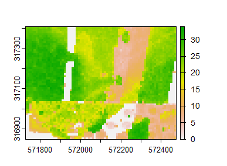

# growthmodels

A collection of tools useful for Polish foresters, forest managers and environmental scientists to work with data from Polish forests at stand, plot or tree level.

# Key features

### Clean and prepare your data

Clean up and convert species names (English, Latin, Polish names, typing errors, extra spaces) to standard abbreviations. Grouping species with similar height, volume and growing requirements based on habitat or natural region, define plot or stand origin (upland or lowland). Useful for calculating V, based on Bruchwald equation.

### Calculate tree level attributes

Calculate tree height and volume based on the:

Bruchwald, A.; Rymer-Dudzińska, T.; Dudek, A.; Michalak, K.; Wróblewski, L.; Zasada, M. Wzory empiryczne do określania wysokości i pierśnicowej liczby kształtu grubizny drzewa. Sylwan 2000, 144, 5–12.


### Calculate  plot/stand level attributes

Calculate TH according to:

Socha, J., Hawryło, P., Stereńczak, K., Miścicki, S., Tymińska-Czabańska, L., Młocek, W., & Gruba, P. (2020). Assessing the sensitivity of site index models developed using bi-temporal airborne laser scanning data to different top height estimates and grid cell sizes. International Journal of Applied Earth Observation and Geoinformation, 91, 102129.

and

Hawryło, P., Socha, J., Wężyk, P., Ochał, W., Krawczyk, W., Miszczyszyn, J., & Tymińska-Czabańska, L. (2024). How to adequately determine the top height of forest stands based on airborne laser scanning point clouds?. Forest Ecology and Management, 551, 121528.

### Calculate Top Heigth of the tree stand



**growthmodels** has two algorithms to calculate top heigth of the tree stand in any resolution. It can be helpful for calculating tree stand parameters or segmentation.

```r
chm = terra::rast(system.file('raster/chm.tif', package = 'growthmodels'))
terra::plot(chm)
th = th_calc(chm, f = "h_sd")
terra::plot(th)
```

# About

**growthmodels** is developed openly at [University of Agriculture in Krakow](https://en.urk.edu.pl/).


