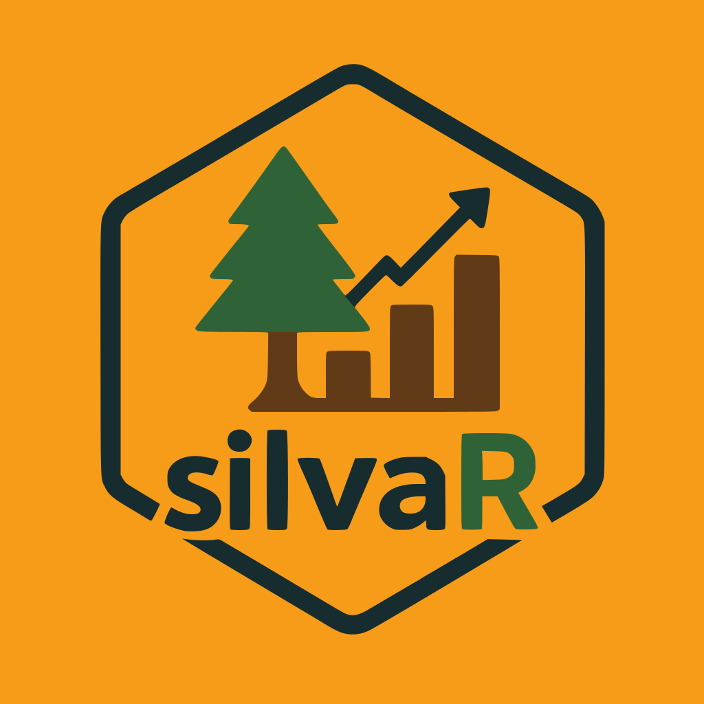
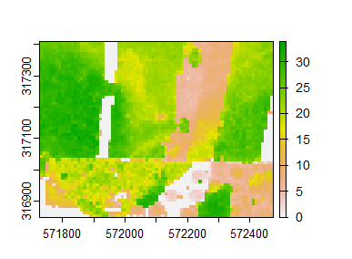
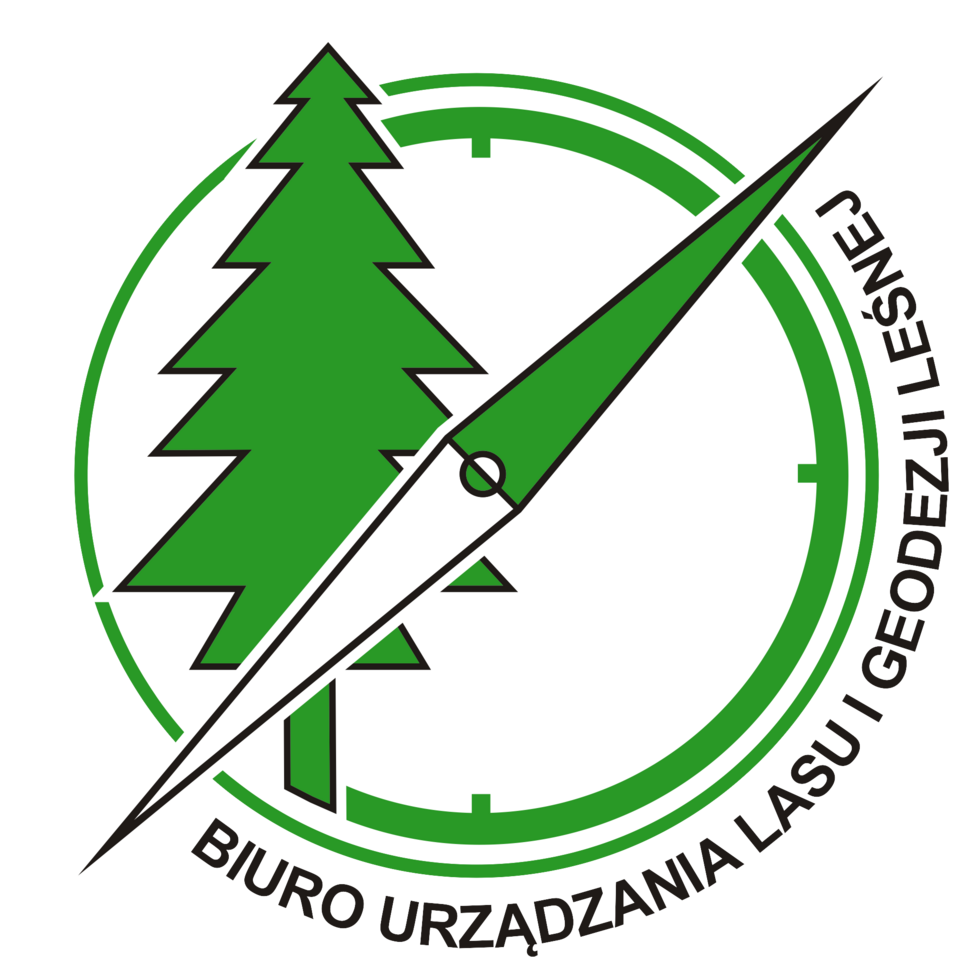

silvaR 
---


[](https://codecov.io/gh/DFRM-FF-UAK/silvaR)
[](https://CRAN.R-project.org/package=silvaR)


**Tools for processing and analyzing forest data from Polish forests**

**silvaR** is an R package providing a collection of tools useful for Polish foresters, forest managers, ecologists and environmental scientists working with stand-, plot- or tree-level data.  
The package supports data cleaning, standardization, attribute calculation and height/volume modelling using widely used Polish forestry equations.

---

## 📜 Citation

If you use **silvaR** in your scientific work, please cite:

Section will be updated soon

> Author(s). (2024). *silvaR: Tools for processing and analyzing forest data from Polish forests*.  
> R package version X.X.X.  
> https://github.com/DFRM-FF-UAK/silvaR

---

# 🚀 Key Features

### **✔ Data cleaning and preparation**
- Standardizes tree species names (Latin, Polish, English), correcting typos and formatting inconsistencies.  
- Converts species names to official Polish forestry abbreviations.  
- Groups species by habitat conditions, natural region or growth characteristics.  
- Classifies plot/stand origin (upland vs lowland).  
- Prepares inputs required for calculating tree volume with Bruchwald equations.

### **✔ Tree-level attribute calculation**
Estimate tree height and stem volume using empirical Polish forestry models:

> Bruchwald, A.; Rymer-Dudzińska, T.; Dudek, A.;  
> Michalak, K.; Wróblewski, L.; Zasada, M. (2000).  
> *Wzory empiryczne do określania wysokości i pierśnicowej liczby kształtu grubizny drzewa.*  
> **Sylwan**, 144, 5–12.

### **✔ Plot and stand evel metrics**
Calculate stand top height (TH) based on:

> Socha, J., Hawryło, P., Stereńczak, K., Miścicki, S.,  
> Tymińska-Czabańska, L., Młocek, W., & Gruba, P. (2020).  
> *Assessing the sensitivity of site index models developed using bi-temporal airborne laser scanning data to different top height estimates and grid cell sizes.*  
> **International Journal of Applied Earth Observation and Geoinformation**, 91, 102129.

and

> Hawryło, P., Socha, J., Wężyk, P., Ochał, W., Krawczyk, W.,  
> Miszczyszyn, J., & Tymińska-Czabańska, L. (2024).  
> *How to adequately determine the top height of forest stands based on airborne laser scanning point clouds?*  
> **Forest Ecology and Management**, 551, 121528.

### **✔ Top height (TH) estimation from raster CHM**
**silvaR** includes algorithms for top height estimation at any spatial resolution,
useful in calculating stand parameters, segmentation or ALS-based inventory workflows.



**Example:**

```r
library(silvaR)

chm <- terra::rast(system.file("inst/raster/chm.tif", 
                               package = "silvaR"))

terra::plot(chm)

th <- th_calc(chm, f = "h_sd")

terra::plot(th)

```
---

## 🔧 Installation
**From GitHub**
```r
# install.packages("devtools")
devtools::install_github("DFRM-FF-UAK/silvaR")
```
---

## 📘 Basic usage example
### Stand level calculations

```r
library(silvaR)

# Example dataset
data(olkusz_v1)
data(olkusz_v2)

# Clean species names
olkusz_v1$species <- sp_clean(olkusz_v1$species)

# Predict tree volume growth in specific period of time
olkusz_v1$vol_growth <- v_growth(stand_id = olkusz_v1$stand_id, 
         years = 10, 
         age = olkusz_v1$age, 
         height = olkusz_v1$height, 
         volume = olkusz_v1$volume, 
         species = olkusz_v1$species, 
         region = olkusz_v1$region)
         
head(olkusz_v1)

# Estimate tree height at age 100
olkusz_v2$h_at_100 <- h_growth(T1 = olkusz_v2$age, 
                               T2 = 100, 
                               H1 = olkusz_v2$height, 
                               species = olkusz_v2$species)
                               
head(olkusz_v2)


```

### Plot level calculations

```r
library(silvaR)

# Load example data
data(rybnikPP)
head(rybnikPP)

# Clean species name
rybnikPP$SPECIES_CD <- sp_clean(rybnikPP$SPECIES_CD)

# Estimate tree height
rybnikPP$TREE_HEIGHT <- h_tree(plot_id = rybnikPP$SAMPLE_NR, 
                               tree_id = rybnikPP$SAMPLE_RECORD_NR, 
                               species = rybnikPP$SPECIES_CD, 
                               age = rybnikPP$TREE_AGE, 
                               layer = rybnikPP$STOREY_NR, 
                               dbh = rybnikPP$BREAST_HEIGHT, 
                               height = rybnikPP$TREE_HEIGHT)

# Estimate single tree volume
rybnikPP$TREE_VOLUME <- v_tree(dbh = rybnikPP$BREAST_HEIGHT, 
                          height = rybnikPP$TREE_HEIGHT, 
                          species = rybnikPP$SPECIES_CD)
                          
head(rybnikPP)
```
---

## 📂 Package structure
```
silvaR/
├── R/                     # Package functions
├── man/                   # Documentation
│   └── figures/           # Logo, images for README/pkgdown
├── raw_data/              # Dictionares
├── data/                  # Example datasets
├── inst/                  # Additional resources
└── tests/                 # Unit tests (testthat)
```
---

## 🤝 Contributing
Contributions, bug reports and feature requests are welcome!
Please open an Issue or submit a Pull Request.

---

## 📄 License
This package is released under the MIT License.

---

## 🏫 About
The **silvaR** package is developed at the [Faculty of Forestry](https://wl.urk.edu.pl/), University of Agriculture in Kraków, 
in collaboration with the [Bureau for Forest Management and Geodesy (BULiGL)](https://www.buligl.pl/), Kraków Regional Office.

---



